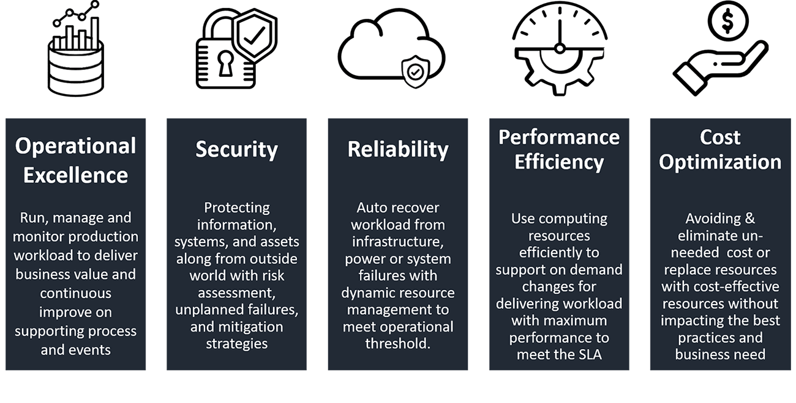

# ☁️ AWS Cloud Study Guide

 

Thanks for reading! This study guide was originally made in April, 2019 and is updated occassionally.

This study guide is also referenced in my [Medium article](https://danblevins.medium.com/my-aws-cloud-study-guide-1fbcb03b9c95).

Want to stay in touch? Connect with me on [LinkedIn](https://www.linkedin.com/in/dan-blevins/)!

 

<h4 align="center">AWS Well-Architected Pillars</h4>

### Table of Contents
- <a href="#azs-edge" style="color: #d4d4d4;">Availability Zones (AZs) and Edge Locations</a>
- <a href="#iam" style="color: #d4d4d4;">IAM (Identity and Access Management)</a>
- <a href="#ec2-ebs" style="color: #d4d4d4;">Elastic Compute Cloud (EC2) & Elastic Block Storage (EBS)</a>
- <a href="#rds" style="color: #d4d4d4;">RDS, Aurora, and Elasticache</a>
- <a href="#route53" style="color: #d4d4d4;">Route 53</a>
- <a href="#instant-apps" style="color: #d4d4d4;">Instantiating Applications Quickly</a>
- <a href="#elastic-bean" style="color: #d4d4d4;">AWS Elastic Beanstalk</a>
- <a href="#s3" style="color: #d4d4d4;">S3 (Simple Storage Service) and Data Management</a>
- <a href="#athena" style="color: #d4d4d4;">AWS Athena</a>
- <a href="#integ-messaging" style="color: #d4d4d4;">AWS Integration & Messaging</a>
- <a href="#serverless-features" style="color: #d4d4d4;">Serverless Features</a>
- <a href="#serverless-apis" style="color: #d4d4d4;">Building Serverless APIs</a>
- <a href="#databases" style="color: #d4d4d4;">Databases</a>
- <a href="#monitor-audit" style="color: #d4d4d4;">AWS Monitoring, Audit, and Performance</a>
- <a href="#security-encryption" style="color: #d4d4d4;">AWS Security and Encryption</a>
- <a href="#vpc" style="color: #d4d4d4;">AWS Networking and VPC</a>
- <a href="#other-services" style="color: #d4d4d4;">Other Services</a>

 
 

**Availability Zones (AZs) and Edge Locations**

- AWS has regions (Examples: us-east-1, us-west-2), which are geographic locations
- Each region has availability zones
- Each availability zone is a physical data center in the region, but isolated enough from the other data centers to avoid natural disasters
- AWS Services are region-scoped, meaning the AWS service only "lives" in the AWS region where it was created. There are three excpetions: IAM, S3, and Route 53 are scoped globally

 

**IAM (Identity and Access Management)**

- IAM is the entire AWS security for resources and access and has a *global view*
- Supports MFA (Multi Factor Authentication)
- Can provide temporary access for users/devices and temporary access to AWS services
- Supports password rotation and enforcement
- Types of IAM:
  - Users: Individual users of AWS with specific access to AWS services
  - Groups: Aggregated set of users with common AWS service access
  - Roles: Entity that has its own set of permissions without being a user or group
  - Policies: Formally defines permissions of users and groups
- Root account has all permissions
  - Best practice: Create other admin users
  - MFA can be set on root account
- IAM Types of Federation:
  - Enterprise Identity: Active Directory
  - Social/Mobile: Google, Facebook, OpenID
  - Cross Account: Allows one AWS account to access another

 

**Elastic Compute Cloud (EC2) & Elastic Block Storage (EBS)**

- EC2 is a web service that provides secure, resizable compute capacity. Designed to make web-scale cloud computing easier for developers
  - High memory, compute optimized, and storage optimized
  - SSH is on port 22. This is where you can lock down security groups to your IP
  - Timeout issues are related to Security group issues
  - Permission issues from SSH key => run “chmod 0400”
- IP Addresses
  - Private IPv4 address: An IP address that is not reachable over the Internet
  - Public IPv4 address: An IP address that is attached with your EC2 instance automatically, but it’s not static. This means if you restart the instance, a new IP address will appear.
  - Elastic IPv4 address: A public, static IP address that is allocated to your account and that you can associate it to and from instances.
- Pricing
  - On-Demand: Standard. Pay for what you use
    - Use case: Short term and un-interrupted workloads
    - Use case: Applications with erratic traffic patterns, Dev Tests, or short-term websites
  - Reserved Instances: Provides guaranteed capacity for 1-year or 3-year signing commitments.
    - Convertible Reserved Instance: Gives you the option to change the EC2 instance type
    - Scheduled Reserved Instance: Launch EC2 within window of time that you reserve
    - Use case: Applications with stable traffic patterns, with occasional spikes
  - Spot Instance: You bid a price on the instance capacity. The instance spins up as long as your bid price is under the AWS capacity price
    - AWS capacity price depends on supply and demand
    - Use case: Used for batch jobs, Big Data analysis, or workloads that are resilient to failure. Not great for critical jobs or databases
  - Dedicated Hosts: Physical dedicated EC2 server for full control
    - 3-year commitment
    - Allows you to use software licenses/other compliance purposes
    - Dedicated Instances: Instances running on hardware that’s dedicated to you
- Main Instance Types
  - Burstable: T2/T3
    - Overall, CPU performance is okay. If there is an unexpected spike, the CPU can burst and support the extra spike
  - General instance type: M4
- EC2 AMI (Amazon Machine Image)
  - Create an image from an EC2 instance that has the pre-installed packages, faster boot time than the original instance, more control.
    - You can also buy/use other people’s public AMIs
  - AMIs are built for a specific AWS region
  - AMIs are stored in S3
  - By default, AMIs are private and locked for your account within that region
  - You can create an AMI from a snapshot
  - You can create an encrypted AMI by:
    - Creating snapshot of root volume
    - Copying the snapshot and turn it into an encrypted snapshot
    - Snapshots can be shared if they are unencrypted
    - Launch new EC2 instance from encrypted snapshot
    - Launch AMI from new EC2 instance
- EC2 Placement Groups: Clusters and Spreads
  - Use Placement Groups if you want control the placement strategy of your EC2 instances
  - Cluster:
    - Cluster is a logical grouping of instances within a single availability zone that promotes low latency
    - Use case: Big Data jobs that need fast compute time, applications that require low latency and high network throughput
  - Spread:
    - Spread instances across the availability zone based on underlying hardware
    - Use case: Application that needs to maximize high availability
- EC2 Security Groups
  - Software firewall that installs automatically as part of AMI. Can decide to create rules which control network traffic access
  - By default, all inbound traffic is blocked and all outbound traffic is open
  - Security groups only allow traffic. They cannot block traffic from specific IP addresses
  - Security group changes take effect immediately
  - Multiple instances can share a security group and one instance can share multiple security groups
  - Security Groups can reference other Security Groups instead of IP ranges
- EC2 User Data
  - Bootstrapping technique used to automate boot tasks such as installing updates, installing software, downloading common files from the internet, etc.
  - EC2 User Data runs with the root user
- EC2 contributes to both vertical scaling (increasing the instance size) and horizontal scaling (increasing the number of instances)
  - High availability: Run instances for the same application across multi AZ, including Auto Scaling Group multi AZ and Load Balancer multi AZ
- EC2 Load Balancers:
  - Load Balancers are servers that forward internet traffic to multiple servers (EC2 instances) downstream
  - Provide SSL certificates
  - Health Checks:
    - Instances are monitored by ELB Health Check. Health Check attempts to contact the specified Health Check webpage. Status is either InService or OutOfService
    - If Health Check is OutOfService, it shuts down that instance and uses your other instances
  - Every Load Balancer has a static host name
  - Load Balancers can scale but not instantaneously
  - Errors: 4xx means client induced, 5xx means application induced
  - Use Cases:
    - Spread traffic load across multiple instances
    - Expose a single point of access (DNS) to your application
    - Seamlessly handle application failures
    - Perform regular health checks on your instances
    - Provide SSL/HTTPS termination for your websites
    - Enforce stickiness with cookies
    - Separate public traffic from private traffic
  - Classic Load Balancer: Older version, basically deprecated
  - Application Load Balancer (Layer 7), for HTTP/HTTPS and Websockets/hostname:
    - Load balancing to multiple HTTP applications across machines (target groups)
    - Load balancing to multiple applications on the same machine (containers)
    - Load balancing based on route in URL
    - Load balancing based on hostname in URL
    - Use case: For micro services and container-based applications. Docker and Amazon ECS
    - Has port mapping feature to redirect to dynamic port
    - Stickiness can be enabled at the target group level. Same request goes to same instance
    - Can route base on hostname/path
  - Network Load Balancer (Layer 4), for TCP:
    - Forward TCP traffic to your instances
    - Handle millions of requests per second
    - Supports static IP or elastic IP
    - Less latency
    - Mostly used for extreme performance and are not a default option
  - Load Balancer Stickiness: Implement stickiness so that the same client is always redirected to the same instance behind a Load Balancer
    - Works for CLB and ALB
    - “Cookie” used for stickiness has an expiration date
    - Use case: Ensure the user doesn’t lose their session data
- EC2 Auto Scaling Group:
  - Having instances under ASG means that if they are terminated, ASG will restart them automatically for extra safety
  - ASG tries to balance the number of instances across AZs by default
  - Cooldown timers help ensure that ASG doesn’t launch or terminate additional instances before previous scaling activity is completed
  - Use case:
    - Scale out EC2 instances to match an increased load
    - Scale in EC2 instances to match a decreased load
    - Ensure we have a minimum and maximum number of machines running
    - Automatically register new instances to a load balancer
  - Attributes:
    - AMI + Instance Type
    - EC2 User Data
    - EBS Volumes
    - Security Groups
    - SSH Key Pair
    - Scaling Policies
  - Rules: Can scale based on EC2 metrics
    - Target Average CPU usage
    - Number of requests on ELB
    - Network In/Network Out
- Amazon CloudWatch:
  - Monitoring application metrics from AWS. Supports dashboards, alarms, events, and logs
  - Possible to scale auto scaling groups by CloudWatch metrics/alarms
- EC2 Elastic Block Storage (EBS):
  - An EC2 instance loses its root volume when it is manually terminated. Unexpected terminations happen sometime. An EBS volume is a network drive (some latency) you can attach to your instances to keep persistent data
    - Can be detached from one EC2 and attached to another. EBS is separate volume storage
    - Locked to one Availability Zone. To move a volume across AZs, you must use a snapshot
    - EBS root volumes are created with instance by default. EBS root volume is deleted on instance termination
    - EBS volumes, excluding EBS root, can be encrypted at creation
    - Have a provisioned capacity that you get billed
  - EBS Volume Types:
    - General Purpose SSB: Standard. Balance price and performance. Common applications
    - Provisioned IOPS: Mission-critical, low-latency, or high-throughput workloads. Use case: Databases
    - Throughput Optimized HDD: Low cost HDD and optimized throughput workloads. Use case: Hadoop Map Reduce and Boot volume
    - Cold HDD: Lowest cost HDD, designed to access data less frequently
    - Magnetic Standard: Lowest cost, designed to access data less frequently
  - EBS Snapshots:
    - Incremental
    - Snapshots stored in S3
    - Not necessary to detach volume to do snapshot, but recommended
    - Lazy Loading: Volume created instantly, but data is brought into storage gradually
    - Can copy snapshots across AZ or Region
    - Can make AMI from Snapshot
    - Snapshots can be automated using Amazon Data Lifecycle Manager
  - EBS Migration and Encryption:
    - EBS Volumes are locked to a specific AZ
    - To migrate it to a different AZ, you must snapshot the volume, copy the volume to a different region, and create a volume from the snapshot in the AZ of your choice
    - EBS volumes leverage keys from KMS AWS Key Management Service (AES-256) can be encrypted upon creation
    - You can copy an unencrypted snapshot and then encrypt it. Snapshots of encrypted volumes are encrypted
  - To encrypt an unencrypted EBS volume:
    - Create EBS snapshot of volume
    - Encrypt EBS snapshot of volume
    - Create new EBS volume from snapshot
    - Now EBS volume is automatically encrypted
  - EBS vs Instance Store: Some instances do not come with a Root EBS volume
    - EBS: Has a root device, meaning if instance is stopped/rebooted, data is retained
    - Instance: The root device is an HDD created from an AMI template stored in S3, meaning if the instance is stopped all the data will be lost
- EC2 Elastic File System (EFS):
  - Shared file system on network file system (NFS) that can be mounted on EC2 instances. Works in Multi AZs.
  - Use cases: Content management, web serving, data sharing, Wordpress
  - Security Groups control access to EFS
  - Encryption at rest using KMS
  - Data is redundantly stored across region
  - Read after write consistency (similar to S3)

 

**RDS, Aurora, and Elasticache**

- Relational Database Service (RDS): Is a managed DB service using SQL
  - Postgres, MySQL, MariaDB, Oracle, Microsoft SQL Server, Aurora (AWS database)
  - Advantage than deploying database on EC2:
    - Managed AWS service, OS patching, maintenance, and monitoring dashboards
    - Read replicas (up to 5) for improved read performance, Multi AZ set up for disaster recovery, and scaling capability
  - RDS Read Replicas
    - 5 read replicas can be within AZ, Cross AZ, and Cross Region
    - Read replicas are async, so reads are eventually consistent
  - RDS Multi AZ Disaster recovery
    - Sync replication
    - Failover in case of loss of AZ
    - Not used for scaling
  - RDS Backups and Snapshots
    - Backups are automatically enabled in RDS
- Daily full snapshots of database
- Captures transaction logs in real time
- By default, backups stored 7 days but can be increased to 35 days
  - Database snapshots are manually triggered by user
- Can retain snapshot as long as you want
  - RDS Encryption
    - Encryption supports at rest with AWS KMS – AES256 encryption
    - Supports SSL certificates to encrypt data to RDS in flight
  - RDS Security
    - RDS databases are usually deployed within a private subnet, not in a public subnet
    - Works by using Security Groups (same as EC2)
    - IAM policies control who can manage RDS
    - IAM authentication works for MySQL and PostgreSQL
    - Lifespan of authentication token is 15 minutes
- AWS Aurora: 
  - Proprietary technology from AWS. Supports Postgres and MySQL. Has better performance improvement over MySQL and Postgres on RDS. Using Global, you can span multiple regions and enable DR. Not using Global, you can create Cross Region Read Replicas
  - Aurora Features
    - Aurora automatically grows in increments of 10GB, up to 64TB
    - Aurora can have 15 read replicas
    - Failover in Aurora is instantaneous
    - Aurora costs more than RDS, but is more efficient
    - Aurora supports Cross Region Replication
  - Aurora Security
    - Encryption at rest using KMS
    - Automated backups, snapshots, and replicas are also encrypted
    - Encryption in flight using SSL
    - Authentication using IAM for MySQL and Postgres
    - You are responsible for protecting instance by using Security Groups
    - Cannot use SSH
  - Aurora Serverless
    - Helpful when you can’t predict workload
    - Can migrate from Aurora Cluster to Aurora Serverless and vice versa
- AWS Elasticache: Makes it easy to deploy, operate, and scale in-memory data store or cache with really high performance and low latency. Used for content websites with large user populations or Ecommerce sites with heavy browsing and product comparison
  - Elasticache Features:
    - Helps reduce load off of databases for read intensive workloads
    - Helps make your application stateless
    - Performs Read Scaling using Read Replicas
    - Uses Multi AZ with Failover Capability
    - Lazy Loading: Read data is cached and can become stale in cache
    - Write Through: Add or updates data in cache when written to a DB, which makes it un-stale
    - Session Store: Store temporary session data in a cache using TTL features
  - Redis: In-memory key-value store with super low latency
    - Use cases: User sessions, Gaming leaderboards, relieve pressure on databases
    - Cache survives reboots by default
    - Multi AZ with Automatic Failover for disaster recovery
    - Supports Read Replicas
    - Has grown in popularity and has better feature sets
    - Security: Supports Redis AUTH, SSL in-flight, encryption must be enabled
  - Memcached: In-memory object store
    - Use case: Quick retrieval of objects from memory, cache often accessed objects
    - Doesn’t survive reboots

 

**Route 53**

- Managed DNS (Domain Name System) and is a collection or rules and records which helps clients understand how to reach a server through URLs
- Most common records are:
  - A: URL to IPv4
  - AAAA: URL to IPv6
  - CNAME: URL to URL
  - Alias: URL to AWS resource
- Route 53 can use public domains that you buy or private domains in your VPCs
- Advanced Features:
  - Load balancing through DNS
  - Health Checks
  - Routing policy:
    - Simple: Traffic sent to single resource. Cannot attach Health Check
    - Weighted: Traffic split among multiple endpoints
    - Latency: Split among endpoints based on latency
    - Failover: Sends to primary location and if it fails then sends to secondary location
    - Geolocation: Traffic sent to user based on on the user’s location
    - Multi Value: Use when routing traffic to multiple resources. Up to 8 healthy records
  - Route 53 as a Registrar
    - Can still use Route 53 if you buy domain for a 3rd party website

 

**Instantiating Applications Quickly**

- When launching EC2, EBS, or RDS, it can take time to install applications, insert initial or recovery data, configure everything, and launch application
- EC2: Use Golden AMI or Bootstrap using User Data
- RDS: Restore from snapshot
- EBS: Restore from snapshot

 

**AWS Elastic Beanstalk**

- Is a developer centric view of deploying an application top to bottom in AWS
- Uses all components with full control over the configuration and deployment strategy
  - Only the application code is the responsibility of the developer
- Three architecture models:
  - Single Instance: Good for development
  - Load Balancer (LBD) + Auto Scaling Group (ASG): Great for production or pre-prod web applications
  - ASG only: Great for non-web apps in production
- You deploy application versions to environments and can promote application versions to the next environment
- Rollback feature to previous application version
- You have full control over lifecycle of environments

 

**S3 (Simple Storage Service) and Data Management**

- S3 allows you to store objects/files in buckets. Buckets defined at Region level
- S3 maximum size is 5TB. If uploading more than 5GB, must use multi-part upload
- Successful file upload returns HTTP 200 code
- S3 has key-value store:
  - Key, Value, Version ID, and Metadata
- S3 Versioning
  - Can use versioning of objects, enabled at bucket level
  - Best practice is to version your buckets to protect against unintended deletes and easy roll back
- S3 Encryption: There are 4 methods of encrypting objects
  - SSE S3: Encrypts S3 objects using keys that are handled and managed by AWS
  - SSE KMS: Encrypts S3 objects using AWS Key Management Service to manage keys
  - SSE C: Used when the client wants to manage their own keys
  - Client Side Encryption: Keys are encrypted by client before they’re put into S3
  - Encryption in transit (SSL): AWS S3 exposes HTTP endpoints for Non-encrypted and HTTPS endpoints for encrypted
    - Can use the endpoint you want, but HTTPS is recommended and mandatory for SSE C
- S3 Security: By default, buckets and objects are private and only accessible by account owner
  - User based:
    - IAM policies: Use to specify which API calls should be allowed for a specific user from IAM console
  - Resource based:
    - Access Control List (ACL): Coarse grained, on or off. Allows cross account
    - Bucket Policies: Fine grained, controls specific buckets/objects. GetObjectACL
  - Networking: Supports VPC endpoints
  - Logging and Audit: S3 access logs can be stores in S3 bucket
  - AWS CloudTrail: Logs API calls
  - S3 User Security:
    - Supports Multi Factor Authentication (MFA) and can be required in versioning and deleting objects
    - Signed URLs: URLs that are valid but only for a limited time. Premium video service for users
  - S3 can also support static websites
    - If you get a 403 error message, make sure the bucket policy allows public reads
- S3 CORS (Cross Origin Resource Sharing):
  - CORS must be enabled to request data from another S3 bucket
  - CORS allows you to limit the number of websites that can request your files in S3
- S3 Consistency
  - Read after write consistency for new PUT objects
  - Eventual consistency for overwrite PUT and DELETE objects
- S3 MFA-Delete: Forces user to generate a code on another device to perform important operations in S3
  - Versioning must be enabled to use MFA
  - Only bucket owner/root account can enable/disable MFA-Delete
- S3 Access Logs: For auditing purposes, can access all logs to S3 buckets
- S3 Cross Region Replication: Replicate S3 buckets across a region
  - Must enable versioning
  - Buckets must be in different Regions
  - Buckets can be from different accounts
  - Copying is asynchronous
  - Must give proper IAM permissions
  - Use cases: Compliance, lower latency access, replication across accounts
- S3 pre-signed URLs: Can generate pre-signed URLs using SDK or CLI
  - Use cases: Allow only logged-in users to view content or download files
- AWS CloudFront: Content Delivery Network. Pushes UI and content to users faster
  - Improves read performance and content is cached at edge
  - Popular with S3 but can also be used in EC2 and Load Balancing
  - Can help against network attacks and uses SSL encryption (HTTPS) to talk to your applications
- CloudFront vs S3 Cross Region Replication
  - CloudFront
    - Global Edge network
    - Files are cached, TTL is about one day
    - For static content that must be available everywhere
  - S3 Cross Region Replication
    - Must be setup for each region you want to replicate
    - Files are updated in near real-time
    - Read only
    - For dynamic content that needs low latency in a few Regions
- S3 Storage Tiers
  - Standard: High durability and availability of objects across multiple AZs
    - Can sustain 2 concurrent facility failures
    - Use case: Big Data analytics, mobile/gaming applications, content distribution
  - Reduced Redundancy (Deprecated): Similar to Standard storage with lower levels of redundancy
    - Use case: Thumbnails, processed data. Data that isn’t that important if it gets lost
  - Standard Infrequent Access: Suitable for data that needs to be accessed less frequently but requires rapid access when needed
    - Use case: For disaster recovery and backups
  - One Zone Infrequent Access: Still infrequent Access but data is stored in a single AZ
    - Use case: Storing secondary backup copies of on-premise data or storing data that you can easily recreate
  - Intelligent Tiering: Automatically moves objects between two access tiers based on changing access patterns
  - S3 Glacier: Archival storage, long term storage
  - S3 Lifecycle Management: Aligns data use patterns to S3 and Glacier storage offerings. Automates service offering transitions. No charge
- Snowball/Snowmobile
  - Snowball: Dedicated, physical data transport solution that helps moving TBs or PBs of data in or out of AWS
  - Snowball Edge: Same dedicated, physical data transport but provides processing power and Lambda functionality for pre-processing
  - Snowmobile: Semitruck for Exabytes of data
- Hybrid Cloud: AWS recently started pushing for this
  - Part of your infrastructure is on the cloud and the other part is on-premise
  - Use: case Long cloud migrations, Security requirements, Compliance requirements, and IT strategy
  - Supports AWS Storage Gateway
- AWS Storage Gateway: A way to connect on premise storage or on premise applications to AWS services
  - File Gateway
    - Configured S3 buckets are accessible using NFS and SMB protocol
    - Supports S3 standard, S3 IA, S3 One Zone IA
    - Bucket access using IAM roles
    - Most recently used data is cached in file gateway
  - Volume Gateway
    - Backed by EBS snapshots which can help restore on premise volumes
    - Stored Volumes: Volumes held on premise and backed up to S3
    - Cached Volumes: Volumes held in S3 and frequently access volumes held on premise
  - Gateway Virtual Tape Library (VTL): Used for archive backup and supports popular backup applications
    - Backed by S3 and Glacier

 

**AWS Athena**

- Serverless service to perform analytics directly against S3 files
- Uses SQL
- Built on Presto: Support CSV, JSON, ORC, etc.
- Use case: Business intelligence/ analytics on VPC Flow Logs, ELB Logs, CloudTrail directly from S3

 

**AWS Integration & Messaging**

- Two patterns of application communication:
  1. Synchronous communications (application to application): Could be a problem if there are sudden spikes of traffic
  2. Asynchronous communications (application to queue to application)
Better to decouple applications and use SQS (queue model), SNS (pub/ sub model), and Kinesis
- SQS – Standard Queue Service
  - Oldest offering, fully managed, low latency
  - Default retention of messages: 4 days, maximum of 14 days
  - No limit to how many messages can be in queue
  - Supports horizontal scaling
  - Can have duplicate messages (at least once delivery) and messages can be out of order (best effort ordering)
- SQS – Delay Queue
  - Delays a message up to 15 minutes so consumers can’t see it right away
  - Default is 0 seconds
  - Can set a default queue level
  - Can override default using DelaySeconds parameter
- SQS – Producing messages
- SQS – Consuming messages
  - Poll SQS for messages
  - Process the message within visibility timeout
  - Visibility timeout: When a consumer polls a message from a queue, the message is invisible to other consumers for a period of time
- SQS – Dead Letter Queue
  - If a consumer fails to process a message within the visibility timeout then the message goes back to the queue
- SQS – Long Polling
  - When a consumer requests message from the queue, it can wait for messages to arrive
  - Long Polling decreases the number of API calls made to SQS
  - Long Polling it preferable to Short Polling
- SQS – FIFO
  - First In First Out
  - Messages are process in order by the consumer
  - Messages are sent exactly once and no per message delay
- AWS SNS: What if you want to send one message to many receivers?
  - Integrates with: CloudWatch, Auto Scaling Groups, S3, CloudFormation
- SNS + SQS
  - Push once in SNS and receive in many SQS
- AWS Kinesis Overview: A managed alternative to Apache Kafka
  - Great for application logs, metrics, IoT, clickstreams, “real time” big data, streaming frameworks
  - Data is automatically replicated to 3 AZs
  - Kinesis Streams
    - Low latency streaming ingest at scale
  - Kinesis Analytics
    - Perform real time analytics on streams using SQL
  - Kinesis Firehose
    - Load stream into S3, Redshift, ElasticSearch. Designed to ingest large amounts of data
  - Data retention is 1 day by default and can go up to 7 days
  - Ability to reprocess and replay data
  - Once data is inserted in Kinesis is can’t be deleted
- Kinesis Stream Shards: One stream is made of many different shards
- Kinesis API
  - PUT records
  - Exceptions
  - Consumers
- Kinesis Security
  - IAM: Controls access and authorization
  - Encryption in flight using HTTPS endpoints
  - Encryption at rest using KMS
  - Client side decryption and encryption is harder
  - VPC endpoints are available for Kinesis to access within VPC
- Kinesis Data Analytics: Auto scaling, managed servers, real time data
  - Perform real time analytics on Kinesis Streams using SQL
  - Can create streams out of real time queries
- Kinesis Firehose: Fully managed service, auto scaling, supports many data formats
  - Near real time
  - Load data Redshift, S3, ElasticSearch, Splunk
- SQS vs SNS vs Kinesis
  - SQS
    - Consumer “pull data”
    - Data is deleted after being consumed
    - Can have as many workers as we want
    - No need to provision throughput
    - No ordering is guaranteed
    - Individual message delay capability
  - SNS
    - Push data to many subscribers
    - Up to 10M subscribers
    - Pub/Sub
    - Up to 100,000 topics
    - No need to provision throughput
    - Integrates with SQS for architecture pattern
  - Kinesis
    - Consumer “pull data”
    - Can have as many workers as we want
    - Possible replay data
    - Real time big data analytics and ETL
    - Ordering at shard level
    - Data expires after 1-7 days
    - Must provision throughput
- Amazon MQ: Managed Apache ActiveMQ
  - SQS, SNS are “cloud-native” services from AWS
  - When migrating to the cloud, instead of re-engineering the application to use SQS and SNS, we use Amazon MQ
  - MQ doesn’t scale as much as SQS and SNS
  - MQ runs on a dedicated machine
  - Has both SQS and SNS features

 

**Serverless Features**

- AWS Lambda
  - Serverless function that is automatically scaled and runs off an event action
- DynamoDB
  - Basics
    - NoSQL database available with replication across 3 AZs
    - Scales to massive workloads and distributed databases
  - DynamoDB Provisioned Throughput
    - Table must have provisioned read and write capacity units
    - Option to set up auto-scaling
    - Throughput can exceed with temporary burst credits
  - DynamoDB DAX (Accelerator)
    - Seamless cache for DynamoDB
    - Writes go through DAX to DynamoDB
  - DynamoDB Streams
    - Changes in DynamoDB (Create, Update, Delete) can end up in a DynamoDB Stream
    - Stream can be read by AWS Lambda
  - Security
    - VPC endpoints to access DynamoDB without internet
    - Access fully controlled by IAM
    - Encryption at rest using KMS
    - Encryption in transit using SSL/TLS
  - Backup and Restore
    - Point in time restore like RDS
    - No performance impact
  - Global Tables
    - Multi region, fully replicated, high performance
  - Amazon DMS can be used to migrate to DynamoDB

 

**Building Serverless APIs**

- API Gateway
  - Basics
    - AWS Lambda + API Gateway: No infrastructure to manage
    - Handle API versioning, different environments, and security
    - Generate SDK and API specifications
    - Cache API responses
  - Outside of VPC
    - AWS Lambda
    - Endpoints on EC2
    - Load Balancers
    - Any AWS service
    - External and publicly accessible HTTP endpoints
  - Inside of VPC
    - AWS Lambda in your VPC
    - EC2 endpints in your VPC
  - IAM Permissions
    - Create IAM policy authorization and attach User/ Role
    - API Gateway verifies IAM permissions passed by calling application
    - Handle authentication and authorization
  - Lambda/Custom Authorizer
    - Uses Lambda to validate the token in header being passed
    - Great for 3rd party tokens
    - Very flexible for IAM policies
  - Cognito User Pools
    - Fully managed user lifecycle
    - Cognito helps with authentication not authorization
- AWS Cognito: User identity and data synchronization service that helps you securely manage and synchronize app data for users across their devices
  - Cognito User Pools
    - Sign in functionality for app users
    - Integrate with API Gateway
  - Cognito Identity Pools
    - Provide AWS credentials to users so they can access AWS resources directly
    - Integrate with Cognito User Pools as an identity provider
  - Cognito Sync
    - Synchronize data from device to Cognito
    - Replaced by AppSync

 

**Databases**

- AWS RDS
  - Overview
    - PostgreSQL, MySQL, Oracle, SQL Server
    - Must provision an EC2 instance and EBS Volume type
    - Supports Read Replicas and Multi AZ
    - Security through IAM, Security Groups, KMS, SLL in transit
    - Backup, Snapshot features
    - Managed and scheduled maintenance
    - Monitoring through CloudWatch
    - Use case: Store relational datasets, perform SQL queries, insert, update, and delete is available
  - Operations: Small downtime when failover occurs, during maintenance, scaling in read replicas/ EC2/ EBS, and application changes
  - Security: AWS Responsible. You can also set up KMS, security groups, IAM policies, user authorization, using SSL. Can be encrypted
  - Reliability: Multi AZ feature, failover
  - Performance: Depends on EC2 instance types, EBS volume type, ability to add Read Replicas. Doesn’t auto-scale
- AWS Aurora RDS
  - Overview
    - Compatible API for PostreSGL/ MySQL
    - Data is held in 6 replicas, across 3 AZs. Multi AZ and Auto Scaling Read Replicas
    - Auto healing capability
    - Define EC2 instance type for aurora instance
    - Same security, monitoring, and maintenance as RDS
    - “Aurora Serverless option”
    - Use case: Same as RDS but with less maintenance, more flexibility, and more performance
  - Operations: Less operations, provides auto-scaling storage
  - Security: AWS Responsible. You can also set up KMS, security groups, IAM policies, user authorization, using SSL. Can be encrypted
  - Reliability: Multi AZ, highly available, Aurora serverless option
  - Performance: 5x performance than RDS. Up to 15 read replicas (compared to 5 for RDS)
  - Cost: Lower cost than enterprise databases like Oracle
- ElastiCache
  - Overview:
    - In-memory data store
    - Must provision EC2 instance type
    - Supports Clustering (Redis) and Multi AZ, Read Replicas (Sharding)
    - Security through IAM, Security Groups, KMS, and Redis Auth
    - Backup, Snapshot features
    - Managed and scheduled maintenance
    - Monitoring through CloudWatch
  - MemCache: Widely adopted memory object caching system. ElastiCache is protocol compliant with MemCache
  - Redis: Open source, in memory data store and cached. Redis compatible in-memory service
  - Operations: Same as RDS
  - Security: AWS Responsible. You can also set up KMS, security groups, IAM policies, user authorization (Redis Auth), using SSL. Can be encrypted
  - Reliability: Clustering, Multi AZ
  - Performance: Sub-millisecond performance for in-memory and Read Replicas
- DynamoDB
  - Overview:
    - NoSQL database
    - Serverless
    - Can replace ElastiCache as a key/value store
    - Highly available, Multi AZ by default, Read and Writes are decoupled, DAX for read cache
    - DynamoDB Streams to integrate with AWS Lambda
    - Monitoring through CloudWatch
    - Use case: Serverless application development. Doesn’t have SQL available
  - Operations: No operations needed, auto scaling capability, and serverless
  - Security: Full security through IAM policies, KMS encryption, SSL in flight
  - Reliability: Multi AZ, Backups
  - Performance: Single digit millisecond performance, DAX for caching read
- S3: Good for static files, key value store for big files, and website hosting
- Athena
  - Overview:
    - Fully managed serverless database with SQL capabilities
    - Used to query data in S3. Pay per query. Output results back to S3
    - Secured through IAM
  - Operations: Serverless
  - Security: IAM and S3 security
  - Reliability: Managed service, highly available
  - Performance: Queries scale based on data size
- Redshift
  - Overview:
    - Best for OLAP: Online analytical processing (analytics and data warehousing)
    - Data is loaded from S3, DynamoDB, DMS, or other DBs
    - Leader node: Shows UI and query results
    - Compute node: Performing queries and sending results to Leader
    - Backup & Restore, Security VPC/IAM/KMS, Monitoring
    - Redshift = Analytics/ BI/ Data Warehouse
- Neptune
  - Fully managed graph database. High relationship data, social networking
  - Highly available across 3 AZs, up to 15 read replicas
  - Continuous backup to S3
  - Supports KMS encryption at rest + HTTPS
  - Neptune = Graphs
- ElasticSearch: Search/Indexing

 

**AWS Monitoring, Audit, and Performance**

- AWS CloudWatch: Provides metrics for every service in AWS. Can create CloudWatch dashboards of metrics
  - EC2 memory usage is by default not pushed
  - CloudWatch Logs, Alarms, Events
- AWS CloudTrail: Provides governance, compliance, and audit for your AWS account. Retrieves history of events/ API calls made within Account

 

**AWS Security and Encryption**

- KMS (Key Management Service): Easy way to control access to your data. Fully integrated with IAM for authorization.
  - Integrates into: EBS, S3, Redshift, RDS, SSM, etc.
  - Anytime you need to share sensitive information
  - Can create, rotation policies, disable, and enable
- STS (Security Token Service): Allows to grant limited and temporary access to AWS resources
  - Federation (Active Directory): Provides a non-AWS user with temporary AWS access
  - AWS Cognito: Makes use of Facebook, Google, Amazon to federate them

 

**AWS Networking and VPC**

- VPC (Virtual Private Cloud): Enables you to launch AWS resources into a virtual environment
  - CIDR: Classless Inter-Domain Range. CIDR is a base IP address and range of addresses from that base
  - Computing resources reside in subnets. VPC can have one or more subnets
  - Subnets: Restricted to single AZ, but a single AZ can contain multiple subnets
  - VPC IP addresses are assigned a private IP address range via CIDR Masking
  - Security:
    - Instance: Security Groups (Stateful – on/off): When you set a rule for inbound traffic, it allows outbound traffic automatically
    - Subnet: Networking Access Control Lists, NACL (Stateless): There are separate rules for inbound and outbound traffic
- NACL are like a firewall which control traffic to and from subnet
- Default NACL allows everything outbound and everything inbound
- Great way of blocking a specific IP at the subnet level
- VPC can have multiple subnets
  - Route tables are used to route network traffic
    - Default route table is created with VPC. Every subnet is associated with one VPC
  - Flow Logs allow to capture and analyze network interface traffic
    - Help monitor and troubleshoot
  - Have to attach an Internet Gateway in VPC to allow internet access
  - Private subnet access to internet via NAT instances or NAT Gateway
  - Private data center access via Virtual Private Gateway
  - AWS Endpoints: Can be placed into your VPC to get direct access
    - Scale horizontal and are redundant
  - Private Link: For non-AWS/ commercial without going across internet
  - VPC Peering: Allows VPC from same or different accounts to be connected
    - One VPC can be peered with multiple VPCs
- Internet Gateway
  - Helps VPC instance connect to internet. Need to edit route tables
  - Scales horizontally and is redundant
  - Must be created separately from VPC
  - One VPC can only be attached to one Internet Gateway
- Network Address Translation (NAT) Instances
  - Allows instances in the private subnets to connect to the internet
  - Must be launched in a public subnet
  - Must have Elastic IP attached to it
  - Route table must be configured to route traffic from private subnets to NAT instance
- Direct Connect: Provides a dedicated private connection from a remote network to your VPC
  - You need to set up a Virtual Private Gateway on your VPC
  - Use Cases
    - Increase bandwidth throughput
    - More consistent network experience
    - Hybrid environments

 

**Other Services**

- CloudFormation: A declarative way of outlining your AWS infrastructure for any resources
  - Templates uploaded in S3 and then referenced in CloudFormation
- AWS Elastic Container Service
  - Helps you run Docker containers on EC2 machines
  - ECS and Docker are very popular microservices
  - Docker: Run a containerized application on any machine with Docker installed
  - Containers allow application to work the same way anywhere
  - More efficient than Virtual Machines
  - Scale containers up and down in seconds
  - Use cases
    - Run microservices
    - Run batch processing / scheduled tasks
    - Migrate applications to the cloud
  - ECS Cluster: A set of EC2 instances / EC2 Auto Scaling
  - ECS services: Application definitions running on ECS cluster
  - ECS tasks: Containers on running to create the application
  - ECS IAM: Roles assigned to tasks to interact with AWS
- AWS Step Functions
  - Build serverless visual workflows to orchestrate your Lambda functions
  - Represent flow as JSON state machine
  - Can integrate with EC2, ECS, On premise servers, and API Gateway
  - Use cases:
    - Order fullfilment, Data processing, Web applications, and Workflows
- AWS Simple Service (SWF)
  - Coordinate work amongst applications
  - Code runs on EC2
  - 1 year maximum runtime
  - Example: Order fulfillment from web to warehouse to delivery
- AWS Elastic Map Reduce (EMR)
  - EMR helps create Hadoop cluster used for Big Data analysis and to process vast amounts of data
  - Also supports Spark, HBase, Presto, etc.
  - Auto-scaling and integrated with Spot Instances
  - Use cases
    - Data processing, machine learning, web indexing, etc.
- AWS Glue
  - Fully managed ETL service
  - Automating time consuming steps of data preparation for analytics
  - Serverless
  - Crawls data sources and identifies data formats. Automated code generation
- AWS OpsWorks
  - Chef & Puppet needed. Help with managing configuration as code
- Elastic Transcoder
  - Convert media files stores in S3 into various formats for tablets, PC, Smartphone, TV, etc.
  - Bit rate optimization, thumbnail, watermarks, captions, etc.
- AWS Organizations
  - Global service that allows to manage multiple AWS accounts. Main account is master account
  - API is available to automate AWS account creation
- AWS Workspaces
  - Managed, secure cloud desktop
  - Integrated with Microsoft Access Directory
- AWS AppSync
  - Store and sync data across mobile web apps in real-time
  - GraphQL
  - Client Code can be generated automatically
  - Integrations with DynamoDB and Lambda
- Single Sign On (SSO)
  - Centrally manager single sign on across multiple AWS Accounts and Business Applications
